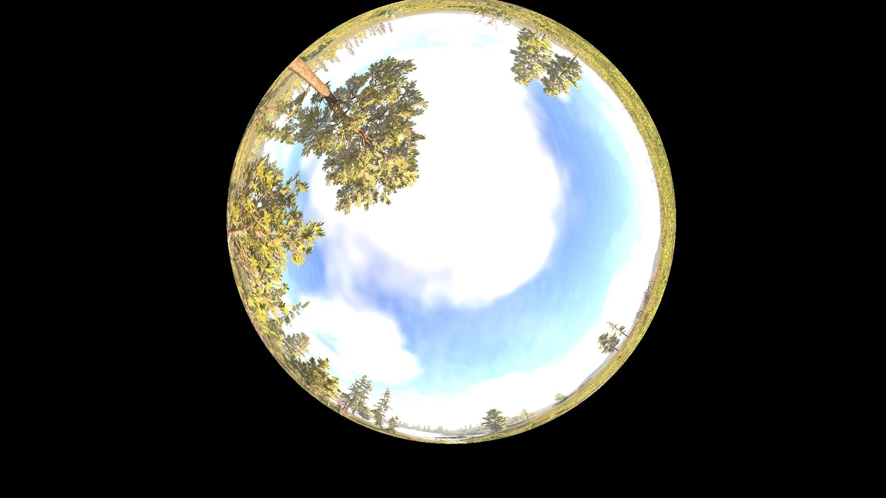
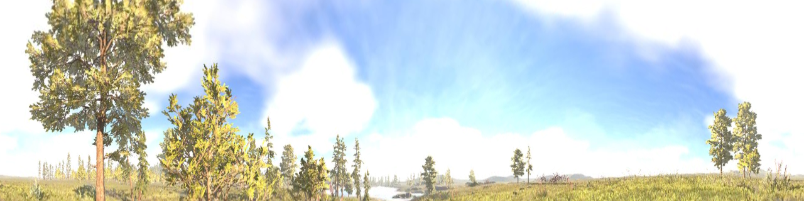

# fisheye2panorama

Convert fisheye camera images into 360° cylindrical panoramas using camera calibration and geometric projection techniques. This tool transforms distorted fisheye images into rectified panoramic views, providing a wide-angle perspective suitable for robotics, surveillance, and computer vision applications.

---

## Features

- **Real-time processing** compatible with live video streams.(only 1ms in my laptop)
- **ROS and OpenCV integration** for seamless deployment in robotic systems.
- **Customizable panorama resolution** and mapping parameters.
- **Lightweight and efficient**, suitable for embedded platforms.

---

## Example

**Source fisheye image:**  


**Converted 360° cylindrical panorama:**  


---

## Applications

- **Autonomous navigation:** provides a 360° environmental view for mobile robots, drones, or autonomous vehicles.
- **Surveillance and monitoring:** enables panoramic coverage with a single fisheye camera, reducing blind spots.
- **Obstacle detection and mapping:** integrates with computer vision algorithms to detect obstacles in real time.
- **Omnidirectional perception:** supports SLAM, visual odometry, and multi-camera fusion in robotics.
- **Virtual reality / immersive video:** generates panoramic imagery from fisheye lenses for immersive VR content.

---

## Installation

Clone this repository into your ROS workspace `src` folder:

```bash
cd ~/catkin_ws/src

git clone https://github.com/canyueduxuan/fisheye2panorama.git

catkin_make

rosrun fisheye2panorama fisheye2panorama_node

```

## Testing

```bash
cd ~/catkin_ws/src/fisheye2panorama/dataset
rosbag play data.bag
``` 