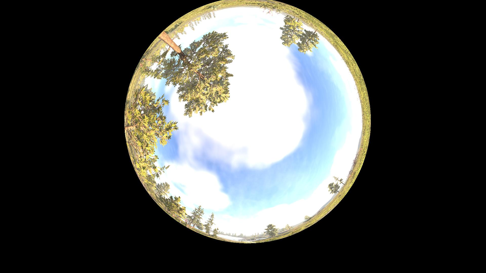
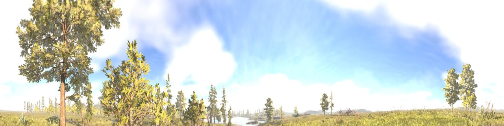
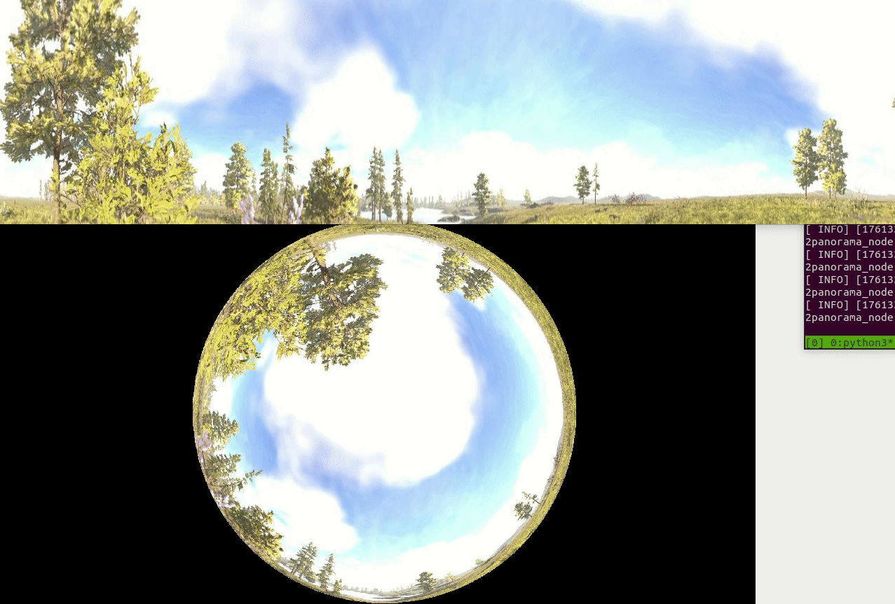

[English](README.md) | [简体中文]

# fisheye2panorama

本项目基于相机标定与几何投影，将鱼眼相机图像转换为 360° 柱面全景图。可将畸变明显的鱼眼画面实时展开为可读性更高的全景视图，适用于机器人、安防监控与计算机视觉等应用场景。

---

## 功能特性

- **实时处理**：可用于实时视频流（作者测试环境约 1ms）。
- **ROS + OpenCV 集成**：便于在机器人系统中快速部署。
- **可配置参数**：支持自定义全景分辨率与映射参数。
- **轻量高效**：适合嵌入式或资源受限平台。

---

## 效果示例

**输入鱼眼图像：**  


**输出 360° 柱面全景图：**  


**视频演示：**  


---

## 典型应用

- **自主导航**：为移动机器人、无人机、无人车提供全向环境感知。
- **安防监控**：单个鱼眼相机实现更大范围覆盖，减少盲区。
- **障碍物检测与建图**：可与视觉算法结合进行实时感知。
- **全向视觉感知**：支持 SLAM、视觉里程计和多相机融合。
- **VR/沉浸式视频**：将鱼眼素材转换为可用全景内容。

---

## 安装与运行

将仓库克隆到 ROS 工作空间的 `src` 目录：

```bash
cd ~/catkin_ws/src
git clone https://github.com/canyueduxuan/fisheye2panorama.git
cd ..
catkin_make
rosrun fisheye2panorama fisheye2panorama_node
```

## 测试

```bash
cd ~/catkin_ws/src/fisheye2panorama/dataset
rosbag play data.bag
```

## 实机部署说明

使用 [kalibr](https://github.com/ethz-asl/kalibr) 标定鱼眼相机的 `eucm-none` 参数，并将参数写入 `config/config.yaml`。同时请确保话题名称与消息类型和实际设备一致。

由于丢失了早期实验结果，这里提供一个去畸变的4路虚拟针孔相机的简单演示（类似 [vins-fisheye](https://github.com/xuhao1/VINS-Fisheye)）：


**可以看到使用eucm-none参数（适用>180°）边缘不会有伪影（拖影）！！！**，实测使用omni-radtan(<180°)在边缘会有伪影（拖影）。

如果因为标定条件限制或者相机质量太垃圾，修改`config.yaml`中的`cylinder_cy`将圆柱相机的光轴向上移动会改善效果，并且不会损失垂直FOV。

## 致谢
灵感来自[vins-fisheye](https://github.com/xuhao1/VINS-Fisheye)

[3D Object Detection from a Single Fisheye Image
Without a Single Fisheye Training Image](https://arxiv.org/abs/2003.03759) 证明了圆柱图像具有沿径向的平移不变性（鱼眼图像没有平移不变性，不可以使用CNN，否则是强迫网络记住物体所在像素坐标），可以使用CNN网络检测3d物体。

## 许可
[MIT LICENSE](LICENSE)

